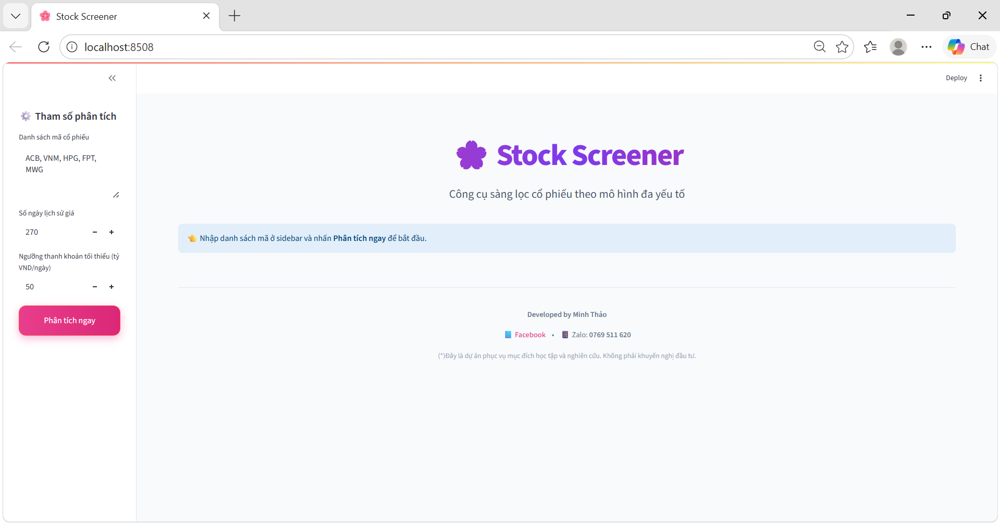
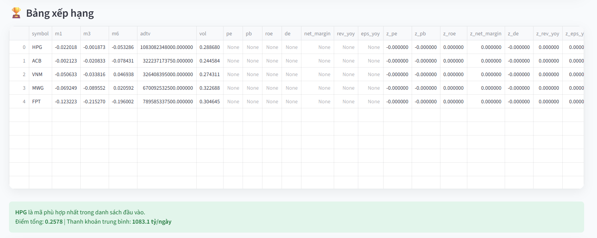
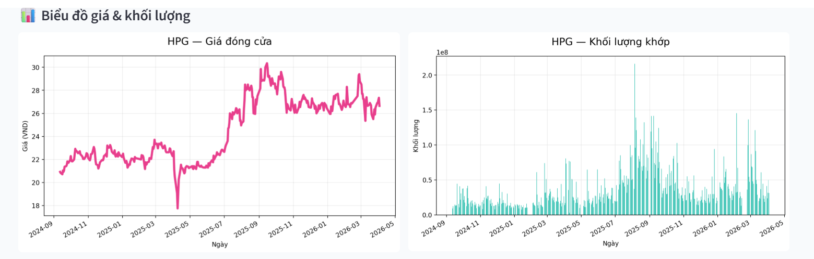

# Stock Screener - Công cụ sàng lọc cổ phiếu đa yếu tố

## Giới thiệu sản phẩm

**Stock Screener** là ứng dụng web giúp sàng lọc cổ phiếu trên thị trường chứng khoán Việt Nam dựa trên **mô hình đa yếu tố (Multi-Factor Model)**.

Ứng dụng tính toán và chấm điểm cổ phiếu theo 6 nhóm yếu tố chính:
- **Value** (Định giá)
- **Quality** (Chất lượng doanh nghiệp)
- **Growth** (Tăng trưởng)
- **Momentum** (Động lượng giá)
- **Liquidity** (Thanh khoản)
- **Risk** (Rủi ro)

Kết quả được trình bày dưới dạng bảng xếp hạng rõ ràng và biểu đồ giá/khối lượng trực quan.

> **Lưu ý quan trọng**: Đây là dự án phục vụ mục đích **học tập và nghiên cứu**, không phải là lời khuyên đầu tư tài chính.

## Minh họa giao diện

**1. Giao diện chính**



**2. Bảng xếp hạng cổ phiếu**



**3. Biểu đồ giá và khối lượng**



##  Insights từ dự án

- Mô hình kết hợp hiệu quả giữa **phân tích cơ bản (Value & Quality)** và **phân tích kỹ thuật (Momentum)**, giúp đánh giá cổ phiếu toàn diện hơn.

- **Thanh khoản (Liquidity)** là yếu tố quan trọng, giúp lọc ra các cổ phiếu có khả năng giao dịch thực tế, tránh những mã khó mua/bán.

- Việc sử dụng **Z-score** giúp chuẩn hóa các chỉ số có thang đo khác nhau, từ đó làm cho quá trình chấm điểm trở nên công bằng và nhất quán hơn.

- Dự án giúp hiểu rõ toàn bộ quy trình xây dựng một hệ thống phân tích:
  - Thu thập dữ liệu
  - Xử lý & tính toán chỉ số
  - Chấm điểm
  - Trực quan hóa kết quả

- Mô hình có khả năng mở rộng trong tương lai với các yếu tố nâng cao như:
  - Phân tích theo ngành (sector)
  - Tin tức & sentiment
  - Yếu tố vĩ mô (macro)


## Hướng dẫn sử dụng

### 1. Cài đặt thư viện
Mở Terminal hoặc Command Prompt và chạy lệnh:
```bash
pip install streamlit pandas matplotlib vnstock numpy
```

### 2. Chạy chương trình
Trong thư mục dự án, chạy lệnh:
```bash
streamlit run app.py
```
Trình duyệt sẽ tự động mở giao diện ứng dụng.

### 3. Cách sử dụng

1. Nhập danh sách mã cổ phiếu (VD: ACB, VNM, HPG)
2. Chọn số ngày lịch sử giá
3. Chọn ngưỡng thanh khoản
4. Nhấn "Phân tích ngay"


## Công nghệ sử dụng

- Python
- Streamlit
- pandas, numpy, matplotlib
- vnstock (thư viện dữ liệu chứng khoán Việt Nam)

###  Cài đặt nhanh bằng requirements.txt (chỉ cần chạy lệnh sau là cài được hết thư viện)

pip install -r requirements.txt

## Cấu trúc dự án

```
Stock_Screener_vivianthao/
├── app.py
├── core.py
├── images/
│ ├── main_interface.png
│ ├── price_volume_chart.png
│ └── ranking_table.png
├── README.md
├── requirements.txt
```

## Lưu ý

- Không phải khuyến nghị đầu tư
- Chỉ mang tính tham khảo

---

**Tác giả:** Trần Đặng Minh Thảo  
Zalo: 0769 511 620
