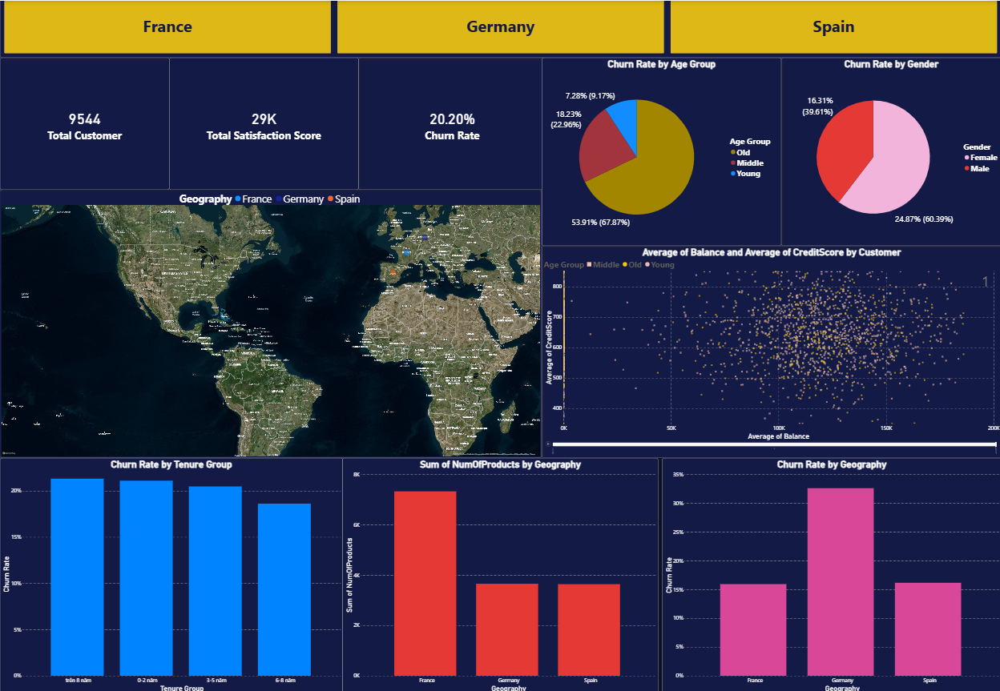

# 📊 Bank Customer Churn Analysis (Power BI + Python)

## 📌 Project Overview

This project analyzes customer churn in the banking sector by combining **Python for data preprocessing** and **Power BI for visualization**. The goal is to uncover key factors influencing churn—such as **Credit Score, Age, Balance, and Geography**—and provide actionable strategies to improve customer retention.

---

## 🎯 Objectives

* Identify key drivers of customer churn
* Analyze behavioral and demographic patterns
* Build an interactive Power BI dashboard
* Propose data-driven retention strategies

---

## 📂 Dataset

* **Source:** Bank Customer Churn Dataset (CSV)
* **Key Features:**

  * CustomerId
  * Geography
  * Gender
  * Age
  * Tenure
  * Balance
  * NumOfProducts
  * CreditScore
  * Exited (Churn Indicator)

---

## 🧹 Data Preparation (Python)

Data preprocessing was performed using Python before importing into Power BI.

### Steps:

* **Import Data**

  * Loaded CSV using `pandas`

* **Data Cleaning**

  * Handled missing values
  * Removed duplicate records based on `CustomerId`
  * Treated outliers in:

    * `Age`
    * `Balance`

* **Feature Engineering**

  * Created new features:

    * **Age Group** (Young, Middle-aged, Senior)
    * **Balance Category**

      * Low: < 50,000
      * Medium: 50,000 – 100,000
      * High: > 100,000

* **Data Export**

  * Saved cleaned dataset to a new CSV file for Power BI usage

---

## 🔍 Data Exploration (Power BI)

### DAX Measures

* **Churn Rate by Geography**
* **Churn Rate by Gender**
* **Average Credit Score by Number of Products**

### Analytical Focus

* Relationship between **Tenure** and churn
* Distribution of customers by **Surname** (grouped if necessary)

---

## 📊 Visualizations & Dashboard

### Key Visuals

* 🌍 **Map Chart**

  * Churn rate by Geography

* 📈 **Scatter Plot**

  * X-axis: Credit Score
  * Y-axis: Balance
  * Color: Age

* 📊 **Bar Chart**

  * Churn rate by Number of Products

### Dashboard Features

* Interactive Power BI dashboard
* Drill-down capability:

  * From country → customer-level insights

---
## 🖼️ Dashboard Preview



---
## 💡 Key Insights

* High churn rates are concentrated in specific geographic regions
* Customers with **low tenure** are more likely to churn
* Lower **credit scores** correlate with higher churn risk
* Older customers tend to maintain **higher balances**

---

## 🚀 Recommendations

* 🎯 **Engage New Customers**

  * Provide onboarding incentives and loyalty programs

* 💳 **Support Low Credit Score Segments**

  * Offer flexible financial products and advisory services

* 🌎 **Focus on High-Churn Regions**

  * Implement targeted retention campaigns

* 📢 **Personalized Marketing**

  * Segment customers based on Age, Balance, and Product usage

---

## 🗂️ Project Structure

```
bank-churn-analysis/
│
├── data/
│   ├── raw/
│   │   └── Bank-Customer-Churn.csv
│   ├── processed/
│   │   └── Bank-Customer-Churn-clean.csv
│
├── notebooks/
│   └── prepaired_data.ipynb
│
├── report/
│   └── Report.pdf
│
├── powerBI/
│   └── dashboard.pbix
│
├── image/
│   └── dashboard.png
└── README.md
```

---

## 🛠 Tools & Technologies

* **Python** (pandas, numpy)
* **Power BI**
* **DAX (Data Analysis Expressions)**

---

## 📌 Conclusion

By integrating Python for data preparation and Power BI for visualization, this project delivers a comprehensive analysis of customer churn. The insights and recommendations can help banks proactively reduce churn and enhance customer retention strategies.

---

## 📎 Author

* Le Nguyen Khoi
